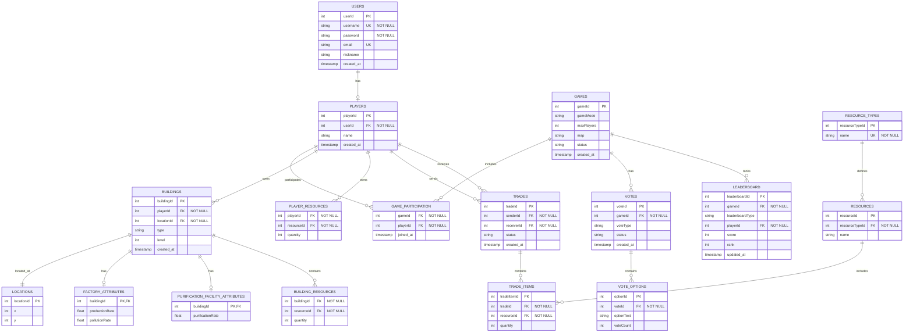

# ECO_QUEST 데이터베이스 설계 문서

## dbdiagram.io를 이용하여 ERD 작성

## 1. ERD (Entity Relationship Diagram)



## 2. 관계 정의서

### 2.1 주요 관계
- Users - Players: 1:1 (한 사용자는 하나의 플레이어 계정을 가짐)
- Players - Games: M:N (game_participation 테이블을 통해 연결)
- Players - Buildings: 1:N (한 플레이어는 여러 건물을 소유)
- Buildings - Locations: 1:1 (한 건물은 하나의 위치에만 존재)

### 2.2 제약조건
- Users.username, Users.email: Unique
- Buildings.location_id: 한 위치에는 하나의 건물만 존재 가능
- Games.status: ENUM('waiting', 'playing', 'finished')
- Trades.status: ENUM('pending', 'completed', 'cancelled')

## 3. Knex.js 모델 정의

```javascript
// models/User.js
class User {
  static tableName = 'users';

  static async create(userData) {
    return await knex(this.tableName).insert(userData).returning('*');
  }

  static async findById(userId) {
    return await knex(this.tableName).where('user_id', userId).first();
  }

  static async findByUsername(username) {
    return await knex(this.tableName).where('username', username).first();
  }
}

// models/Game.js
class Game {
  static tableName = 'games';

  static async create(gameData) {
    return await knex(this.tableName).insert(gameData).returning('*');
  }

  static async getGameState(gameId) {
    return await knex(this.tableName)
      .where('game_id', gameId)
      .first()
      .withGraphFetched('[players, buildings, votes]');
  }
}

// models/Building.js
class Building {
  static tableName = 'buildings';

  static async create(buildingData) {
    return await knex(this.tableName).insert(buildingData).returning('*');
  }

  static async getByGame(gameId) {
    return await knex(this.tableName)
      .join('game_participation', 'buildings.player_id', 'game_participation.player_id')
      .where('game_participation.game_id', gameId);
  }
}

// models/Trade.js
class Trade {
  static tableName = 'trades';

  static async createTrade(tradeData) {
    return await knex.transaction(async (trx) => {
      const trade = await trx(this.tableName).insert(tradeData).returning('*');
      // Additional trade logic
      return trade;
    });
  }
}
```

## 4. 마이그레이션 예시

```javascript
// migrations/20240109_initial.js
exports.up = function(knex) {
  return knex.schema
    .createTable('users', (table) => {
      table.increments('user_id').primary();
      table.string('username').unique().notNullable();
      table.string('password').notNullable();
      table.string('email').unique();
      table.string('nickname');
      table.timestamp('created_at').defaultTo(knex.fn.now());
    })
    .createTable('games', (table) => {
      table.increments('game_id').primary();
      table.enu('status', ['waiting', 'playing', 'finished']).defaultTo('waiting');
      table.string('game_mode');
      table.integer('max_players');
      table.string('map');
      table.timestamp('created_at').defaultTo(knex.fn.now());
    });
};

exports.down = function(knex) {
  return knex.schema
    .dropTable('games')
    .dropTable('users');
};
```

## 5. 시딩 예시

```javascript
// seeds/initial_data.js
exports.seed = async function(knex) {
  // Clear existing entries
  await knex('users').del();
  await knex('games').del();

  // Insert seed data
  await knex('users').insert([
    {username: 'test1', password: 'hashed_pwd', email: 'test1@example.com'},
    {username: 'test2', password: 'hashed_pwd', email: 'test2@example.com'}
  ]);
};
```

Citations:
[1] https://ppl-ai-file-upload.s3.amazonaws.com/web/direct-files/31313424/d07c0e3f-8a04-4377-8471-389f073bea02/paste.txt